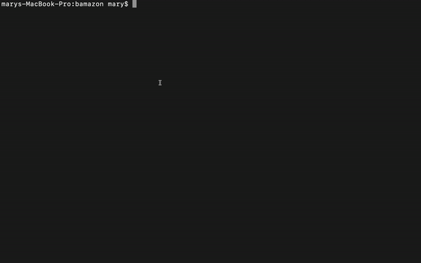

# Bamazon

This is a command line Node app that will take in orders from customers and deplete stock from the store's inventory. 

# Getting Started

Please run NPM install - node modules: Inquirer, Mysql, and Cli-table are all included in package.json.
Next, run node bamazonCustomer.js
Here is an example of how this app works:

# Built With

This app was built with:

Javascript

Node JS

MySQL

NPM Package: mysql, inquirer, cli-table